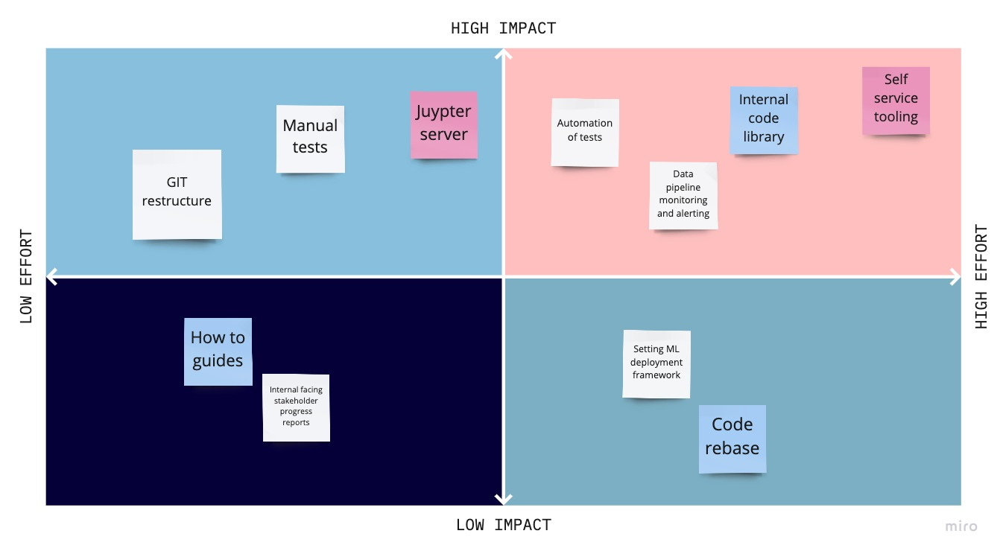

  
  
  
In creating my 90 day plan I leant on the overall mission of the data function at Transpower which can be summarised succinctly as **"Enhancing decision making"**. Then taking assumptions from previous conversations, I feel I have a solid understanding of where the organisation wants to be in 3 years time. 

- Self servicing

- Automated tests, alerting, pipelines and deployments

- Predictive analytics

- Data as a service 

- Integration of DevOps as a practice

The challenge: In 90 days, in a new role, in a new team, how can we deliver success?

----

## **Building foundations while delivering milestone achievements**

Taking predictive analytics as an example: 
- To have predictive analytics we need to have a prediction model serving production data
  - In order to have that we need to have the framework for production deployment 
    - In order to have that we need to have consistent data and tooling to unlock the ability of individuals build out these frameworks
    
So a foundation building block is providing a consistent working environment that is industry standard, unblocking the analytics function. I propose this is a **juypter server.** It does not give us predictive analytics but a milestone achievement along the path to predictive analytics.

----

## **Prioritization framework**

Considering the above, how should we define what can and should be achieved by this role in the 90 day time frame? Leveraging a simple Effort vs Impact quadrant the 90 plan focuses on quick wins and laying foundations for strategic innovation. 

----

## **90 days into 6 cycles**

Splitting out the 90 days into three key focus areas:

- GIT and workflows
- Data and tooling
- Stakeholder engagement

We are aiming to achieve milestones of 
- Sprint cycles
- Deployment and production tests
- Code review
- Jupyter application for analytics
- Data pipelines alerting and monitoring

<iframe width="768" height="432" src="https://miro.com/app/live-embed/o9J_lIdLtA4=/?moveToViewport=-1461,-1198,4654,2293" frameBorder="0" scrolling="no" allowFullScreen></iframe>
  
  
  
  
  ---
  
  On to the [presentation](https://docs.google.com/presentation/d/e/2PACX-1vTcvnd3LyCumwx_fTDpHeCQEbStDxta_lMlzk44grWiXyo_65C9jnD79uHGJhJNbfL3P1WqtRAztIRF/pub?start=false&loop=false&delayms=3000)