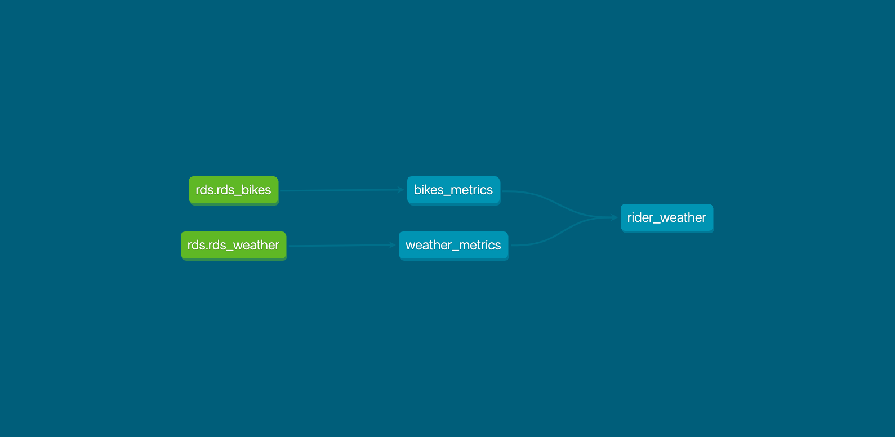
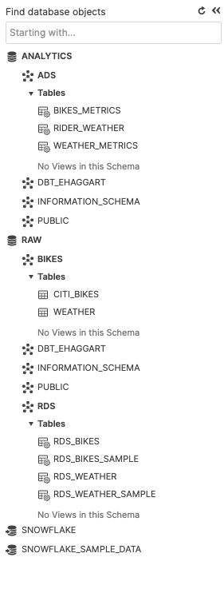

### [Presentation code](https://gitlab.com/ezekiel.j.p.h/analytics)

## Overview

This presentation takes two datasets provided and leveraging both snowflake and DBT demonstrates the benefits of pivoting to a modern platform.
Additionally I have introduced a presentation layer using both Gitab and R to further touch on the flexiblity of using a rapid development. 

The presentation is outlines in the following way

- Approach:
- Data
- Results
- A/B Testing
- Discussion points

  
## Approach
### DBT
Not wanting to reinvent the wheel I followed the standard user guide [here](https://discourse.getdbt.com/t/setting-up-snowflake-the-exact-grant-statements-we-run/439) focusing on ensuring a reproducible pattern was established.

### Database structure
I decided on a two step approach for the database structure where the initial data was inserted in its entirety into the `RAW/BIKES` layer then I constructed a "Raw Data Store" `RAW/RDS` that was to be used as the source layer. 

This was to provide clear and definable separation between working in the snowflake UI and within a development environment in DBT. It also has a number of associated benefits:

- Assuming you wanted to automate the ingestion it would protect downstream dependencies  
- json handling
- DBT mapping
- Developer friendly documentation


```
RAW
----/BIKES
---------/CITI_BIKES  
---------/WEATHER
----/RDS
--------/RDS_BIKES
--------/RDS_BIKES_SAMPLE
--------/RDS_WEATHER
--------/RDS_WEATHER_SAMPLE

ANALYTICS
---------/ADS
-------------/BIKES_METRICS
-------------/RIDER_WEATHER
-------------/WEATHER_METRICS
```

With the plan as above DBT will pass the data from as 



### Snowflake

The snowflake database then takes the shape as follows below with an initial setup piece and establishing connections to the S3 buckets that is captured with a few scripts.




- [s3 connections](https://gitlab.com/ezekiel.j.p.h/analytics/-/blob/main/analysis/snowflake/s3_connections.sql)
- [setup](https://gitlab.com/ezekiel.j.p.h/analytics/-/blob/main/analysis/snowflake/setup.sql)


### Gitlab 
The codebase is captured [here](https://gitlab.com/ezekiel.j.p.h/analytics). As it is a single developer working on the project I set up a simple structure of allowing for direct code commits and pushes against a feature branch and self approval into main.

Environmentally there is no consideration to promotion of code through environments but structurally the separation could be introduced by extending the native dbt_user protections and moving the jobs onto protected branches.
  
## Data
The raw data was located in two sets under the database raw:

bikes: `https://s3.amazonaws.com/tripdata/index.html`

weather: `s3://snowflake-workshop-lab/weather-nyc`

#### Bikes 
Taking a sample in R to prepare the load we were left with the following structure
```
create or replace table citi
(tripduration integer,
  starttime timestamp,
  stoptime timestamp,
  start_station_id integer,
  start_station_name string,
  start_station_latitude float,
  start_station_longitude float,
  end_station_id integer,
  end_station_name string,
  end_station_latitude float,
  end_station_longitude float,
  bikeid integer,
  membership_type string,
  usertype string,
  birth_year integer,
  gender integer);

```

Looking a little closer (after some googling) I found there was a path declared online for the s3 bucket in the following format.AsIs(

```
URL s3://snowflake-workshop-lab/citibike-trips
```

This allowed me to input all 61 million rows... which may have been excessive for the exercise but I digress. 

#### Weather

The weather dataset followed the exact same pattern apart from leveraging a standard JSON pattern. Which snowflake lets us deal with really cleanly

```
{
  "city": {
    "coord": {
      "lat": 43.000351,
      "lon": -75.499901
    },
    "country": "US",
    "findname": "NEW YORK",
    "id": 5128638,
    "langs": [
      {
        "abbr": "NY"
      },
      {
...
      },
      {
        "zh": "纽约州"
      }
    ],
    "name": "New York",
    "zoom": 1
  },
  "clouds": {
    "all": 90
  },
  "main": {
    "humidity": 81,
    "pressure": 1016,
    "temp": 285.53,
    "temp_max": 286.15,
    "temp_min": 285.15
  },
  "time": 1478206834,
  "weather": [
    {
      "description": "overcast clouds",
      "icon": "04d",
      "id": 804,
      "main": "Clouds"
    }
  ],
  "wind": {
    "deg": 280,
    "speed": 6.2
  }
}
```

All I actually want from here is weather so lets get temp, wind speed, and the weather

## Results
Now with all the data loaded into snowflake via DBT I wanted to connect something that would be able to display it in a meaningful way. So creating a connection into R I made a few graphics to understand the posed questions.

I wanted to use highcharter so I connected the snowflake instance to R for more fluid datacleaning ahead of presentation

```{r}

install.packages(c("DBI", "dplyr","dbplyr","odbc", "Rcpp"))
library(DBI)
library(dplyr)
library(dbplyr)
library(odbc)
library(Rcpp)


con <- DBI::dbConnect(odbc::odbc(),
                      Driver       = "/opt/snowflake/snowflakeodbc/lib/universal/libSnowflake.dylib",
                      Server       = "jm03779.ap-southeast-2.snowflakecomputing.com",
                      UID          =  rstudioapi::askForPassword("Database user"),
                      PWD          =  rstudioapi::askForPassword("Database password"),
                      Database     = "Analytics",
                      Warehouse    = "compute_wh",
                      Schema       = "ads"
)


DBI::dbGetQuery(con,"USE ROLE TRANSFORMER;")
DBI::dbGetQuery(con,"USE WAREHOUSE TRANSFORMING;")

base_bike <- DBI::dbGetQuery(con,"SELECT * FROM ANALYTICS.ADS.BIKES_METRICS;")
base_weather <- DBI::dbGetQuery(con,"SELECT * FROM ANALYTICS.ADS.WEATHER_METRICS;")
base_join <- DBI::dbGetQuery(con,"SELECT * FROM ANALYTICS.ADS.RIDER_WEATHER;")

#totals 
base_bike %>%
  na.omit() %>%
  summarise(sum(TRIPS_COUNT), sum(DISTANCE_TOTAL), mean(DURATION_AVERAGE))

```

#### Number of trips

The total number of trips over the period was *61,468,359* 


<iframe width="768" height="432" src="https://ezekiel.nz/Widgets/bike_distance.html" frameBorder="0" scrolling="no" allowFullScreen></iframe>


#### Distance travelled

The total distance traveleld was _(rounded for obvious reasons)_   *111,215,593*. This was achieved using the haversine function as hinted in snowflake.

```
{{ 
    config(materialized='table', database='analytics') 
}}

-- this aggregates by hour the metrics of distance, time and totals 

select 
    date_trunc('hour', starttime) as date
    , count(*) as trips_count
    , sum(tripduration) as duration_total
    , avg(tripduration) as duration_average
    , sum(haversine(
            start_station_latitude
            , start_station_longitude
            , end_station_latitude
            , end_station_longitude
            )) as distance_total
    , avg(haversine(
            start_station_latitude
            , start_station_longitude
            , end_station_latitude
            , end_station_longitude
            )) as distance_average

 from {{ source('rds', 'rds_bikes') }} 
 group by 1

```


<iframe width="768" height="432" src="https://ezekiel.nz/Widgets/bike_totals.html" frameBorder="0" scrolling="no" allowFullScreen></iframe>


#### Average trip duration

Now this is a bit more interesting of a question. In terms of average duration the average of what? Each trip? The dataset was aggregated at the hour layer so the presentation layer passes a `DURATION_AVERAGE` column which is the average of averages. Which is *916.8* Trip Duration (seconds)


## A/B testing

Trying to understand if weather has an impact on ridership we need to combine the datasets and run an analysis overtop of it. 

The approach I have decided to go for is using R to run a linear regression and checking for significance. 

#### The data 
We had two datasets weather and bikes data. I decided to aggregate the weather into hourly buckets and took the most prevaling type, for example if there is 2 occurances of rain and one of clear it would call the hour rain.  

```
-- this assigns a weather for any given hour, could add tempature, wind etc if needed

select 
    weather
    , date
from
(
    select
        weather 
        , date_trunc('hour', time) as date
        , count(*) as n
        , row_number() over (partition by date order by n desc) rank_number
    from {{ source('rds', 'rds_weather') }}  
    group by 1, 2

) where rank_number = 1

```

Now I aggregated the riders into hour buckets as well and joined up the dataset. So question remains does the weather impact the riders. 

So we have the following weather which I then grouped into 'good' and 'bad':

```
          WEATHER   WEATHER_TYPE
1         "Clear"   "Good"
2          "Mist"   "Bad"
3        "Clouds"   "Good"
4          "Rain"   "Bad"
5          "Haze"   "Bad"
6  "Thunderstorm"   "Bad"
7           "Fog"   "Bad"
8       "Drizzle"   "Bad"
9          "Snow"   "Bad"
10        "Smoke"   "Bad"
11       "Squall"   "Bad"
```

Here we just want to look at the weather as there are only 24 hours in the day to get a sense of is the weather good or bad in NYC? Also doing this highlighed a data quality issue in the analysis and narrowed the date range down to 2017-03-01. 

<iframe width="768" height="432" src="https://ezekiel.nz/Widgets/weather.html" frameBorder="0" scrolling="no" allowFullScreen></iframe>


So now lets consider the two averages are there more trips when its good weather? 

<iframe width="768" height="432" src="https://ezekiel.nz/Widgets/chart_split.html" frameBorder="0" scrolling="no" allowFullScreen></iframe>


It looks like it does. Now to validate this I would need to construct a boolean variable off of this and check its significance as an explanation. Though I am going to stop right here.


## Discussion

- Separating DBT loading and running function to deliver a more stable solution.
- Using a full code based solution you can see and replicate 100% of what I have completed.
- Native connections into R, Python will allow a positioning as a 'data plumber' and appeal to the new world.


