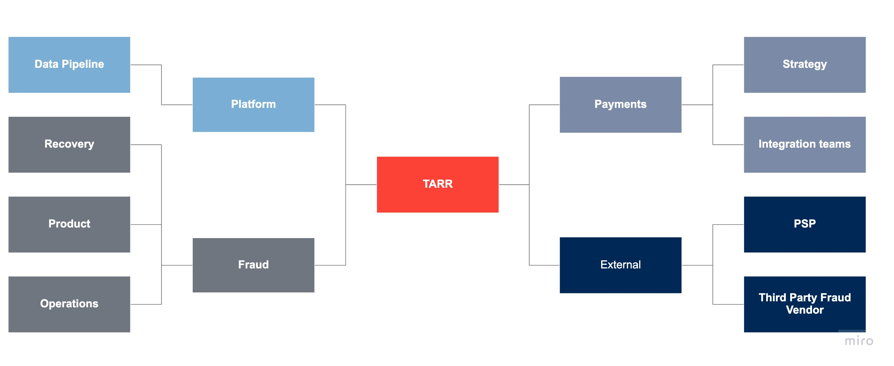

A project I am proud of is rolling out a strategy to send fraud rejected traffic to 3DS unlocking 40+ million in benefit from otherwise declined  good bookers. Why am I proud of this, well it worked. Until it didn't. Righting the ship took made the project more interesting. 

Also similar to how you work at Vend this project was conceived and driven between myself and an engineering lead. 

## Agenda

So what are we going to talk about today?

- Background, what is fraud? what is the product vision?
- Why TARR, why now?
- Exploring the idea, using GOAL
- Roll out and delegation. 
- Unforeseen risks righting the ship
- Reflections

## Background and what is fraud?

Given you have given me up to an hour to present Ive taken the liberty to take my time and show you how to commit fraud. 

[What is payments fraud anyway?](https://docs.google.com/presentation/d/e/2PACX-1vTYrcIjbag7OPlnpeOlxMGg1p493MFYcujaC9XX4Q87_tyC-nJkL6Jz8KnU6tQNtw31qXrWhKhlGcGp/pub?start=false&loop=false&delayms=3000)

So now we know how to commit fraud what is it I do and "why does this matter"

- 100s of millions at risk a year. 
- Solution stop fraud by stopping all payments... so the ongoing challenge is balancing fraud risk while approving good customers. 
- The team is then tasked with constantly trying to move the needle on the cost of fraud metric, while products, markets and strategy moves.  

--- 
--- 

## TARR

**So how can you move the needle along, improve good traffic being accepted or block more fraud.**  Looking across the payment flow we see oppotunities and risks.

<iframe width="768" height="432" src="https://ezekiel.nz/Widgets/sankeyColor1.html" frameBorder="0" scrolling="no" allowFullScreen></iframe>

We can improve the ML model, improve features, outsource a 3rd party liability shift after decline. Continuous improvement aside, how do we come up with creative (read good) ideas? Staying involved in what matters, discussions with vendors, colleges and the business, watching the movements of the industry and competitors. 

Weekly discussions across internal payments teams, platform, accommodations operations allows us to better understand where we are what blockers are there and have been moved. 

So where were we?
- COVID had lowered traffic substantially (outside impact)
- Riskified (our vendor) was being pushed to preform better.
- Our model was preformant and gains slower (continuous improvement)
- Operations had limited ability to find golden features.
- **Platform had recently migrated all 3DS SCA flows allowing for better visibility**

This Last point was the basis for trying out a new approach to unlock the good customers in declined. 3DS was historically a black box SCA improved the infrastructure for visibility. We had stable fraud rates and due to COVID the risk was higher of rejecting good traffic. 

We considered what if we just sent all the rejected traffic to 3DS? **Terrible idea.** but  could we make it a good one. 

<iframe width="768" height="432" src="https://ezekiel.nz/Widgets/sankeyColor2.html" frameBorder="0" scrolling="no" allowFullScreen></iframe>

Outside of the gain from moving the needle along we were targeting.
- Customer experience, customers otherwise rejected would now have a path to book. 
- Lowering impact on CS and PS outbound. 
- Increasing authorizations on traffic supporting payments strategic goals. 

---
---

#### TARR using the GAME structure. 

- **Goal** Release a new pipeline to unlock customers otherwise rejected for fraud.
- **Action** Construct and monitor an ability to send rejected customers to 3DS. 
  - Ensure 3DS flow was being triggered.
  - Ensure there was an opt out option.
  - Appropriate flags to be passed and documented. 
  - Monitoring ongoing and actionable. 
- **Metrics** 
  - High level
    - Fraud rate
    - Product cost (Added commission less fraud)
    - Traffic
  - Detailed level
    - Growth by 'segment' 
    - ~~Liability~~
    - ~~3DS enrollment~~
    - 3DS pass rates (proxy)
- **Evaluate** Evaluate if the metric could be a false positive indicator
  - As fraud takes time to mature 

#### Mapping stakeholders

We wanted to consider the impact the project would have on various teams the level of commitment required and how aligned with product goals it was. Touching on some of the key points of consideration below. 

**Fraud**
- Clearly mapped goals.
- Increasing fraud risk with new flow.
- Addition of technical debt.

**Payments**
- Upstream and downstream stakeholders.
- Potential blocker. 
- Ensure product did not impact existing strategic markets or experiments.

**Platform**
- Support long term and dependent on flags.

**External**
- Managing expectations and describing the product goals and risks clearly.

So how? Proposal doc, drafted then reviewed within fraud. Presented to payments and platform PMs. Signed off and then road mapped. 

#### Getting buy in 

How you involved the rest of the company and ensured their buy in

Ongoing relationships with each of the various teams

---

## Roll out and delegation. 

Engaging in consensus the project built out a new flow for traffic, bespoke monitoring and mitigation. 

- Incremental 
Cycle review, early coms, contious updates. 
5% to 10% 

then moving to a stakeholder as the senior analyst took over monitoring and implimentation and communication with the dev to update the flows. 

Leveraging learnings into further work on vendor management and foundational work for other products. 

## Unforeseen risks righting the ship

4 - 6 weeks later. Early issues began to emerge. Metric xyz increased. The analyst investigating the situation explained the issue. Fraud was being sent to 3DS yes. But it was sometimes enrolled while shopping passing the liability back to us. 

Metrics of fraud rate and traffic showed something was going very wrong.

<iframe width="768" height="432" src="https://ezekiel.nz/Widgets/chart.html" frameBorder="0" scrolling="no" allowFullScreen></iframe>
Graph here on 
- all data is dummy

Short term scale back from 50% to 5% with specific behavioural pattern blocked

- No operational ability to mitigate over time
- Payments track did not have this feature available and was likely a 6 week ask. 
- Discussions quickly upward to send early signal that project might be killed.
- Bridged discussion with our PSP on solution, able to buy off the shelf a a solution that can be implimented on the specific call. 

- Righting the ship

Under 1 week turn around on off shelf solution. Re trigger up to 50% scale and monitor. 

---

- Reflections

Outside normal analyst flow

### TARR at vend??

Well Vend is not the merchant on record, so maybe not a good idea, but your customers care. 

What I hope this project highlights that I do think is impactful at Vend.
- Developing new ideas ontop of existing frameworks
- point point

A final point is maybe where is Vend going? When you consider the likes of Booking, Uber, Amazon all applying for payment service licenses the impact of owning that payment flow has immense benfits at scale. 

So where is Vend going? One big risk I see is [Stripe](https://stripe.com/nz/terminal?utm_campaign=paid_generic-NZ_Search_Category_Terminal-12762805561&utm_medium=cpc&utm_source=google&ad_content=514924567826&utm_term=kwd-869085600&utm_matchtype=b&utm_adposition=&utm_device=c&gclid=Cj0KCQjwvr6EBhDOARIsAPpqUPFH62E8GZfgt6psLQrLS9o2eiVmW6MIMkn_WXbHQd4qbrt8ycsI5LAaAga-EALw_wcB) they have more data. 
