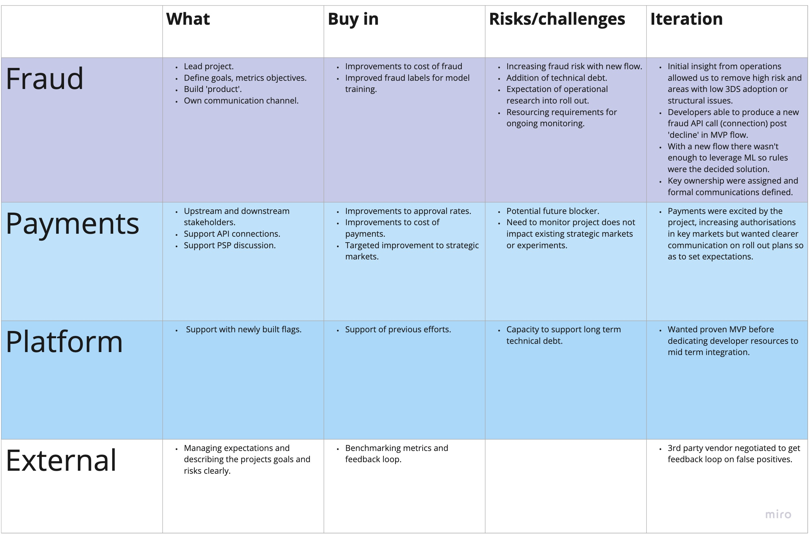

###### *All figures are made up for illustrative purposes*

A project I am proud of is rolling out a strategy to send fraud rejected traffic to 3DS unlocking 40+ million in benefit from otherwise declined good customers. Why am I proud of this, well it worked. Until it didn't. Righting the ship was a challenge and ultimately the solution highlighted what was great about this project. 

## Agenda

So what are we going to talk about today?

- Background, what is fraud? what is the product vision?
- Why TARR, why now?
- Exploring the idea, using GOAL
- Roll out and delegation 
- Unforeseen risks righting the ship
- Reflections

## Background and what is fraud?

Given you have given me up to an hour to present I've taken the liberty to take my time and show you how to commit fraud. 

[What is payments fraud anyway?](https://docs.google.com/presentation/d/e/2PACX-1vTYrcIjbag7OPlnpeOlxMGg1p493MFYcujaC9XX4Q87_tyC-nJkL6Jz8KnU6tQNtw31qXrWhKhlGcGp/pub?start=false&loop=false&delayms=3000)

With 100s of millions at risk a year we would want a solution to stop it.
- One solution is to stop all the fraud, by stopping all payments... so the ongoing challenge is balancing fraud risk while approving good customers. 

So our **product vision** is all about improving payment performance. 
- The team is then tasked with constantly trying to move the needle on the cost of fraud metric, while products, markets and strategy moves.  

So now we know what fraud is, and why does it matters lets talk about the TARR project.

--- 
--- 

## TARR

**So how can you move the needle along, improve good traffic being accepted or block more fraud.**  Looking across the payment flow we see opportunities and risks.

<iframe width="768" height="432" src="https://ezekiel.nz/Widgets/sankeyColor1.html" frameBorder="0" scrolling="no" allowFullScreen></iframe>

We can improve the model accept by investments in ML or new/improved features. Or our outsourced 3rd party vendor can be pushed to improve performance. Continuous improvement aside, how do we come up with creative (read good) ideas? 

Staying involved in what matters, discussions with vendors, colleges and the business, watching the movements of the industry and competitors. Weekly discussions across internal payments teams, platform, accommodations operations allows us to better understand where we are what blockers are there and have been moved. 

So right before TARR where were we?
- COVID had lowered traffic substantially (outside impact).
- Riskified (our 3rd party vendor) was being pushed to preform better, within expectations.
- Our model was preformant and gains slower (continuous improvement).
- Operations had limited ability to find or optimize features.
- **Platform had recently migrated all SCA flows allowing for better visibility into 3DS**.

This last point was the basis for trying out a new approach to unlock the good customers in declined bucket. 3DS was historically a black box SCA forced an improvement of the infrastructure increasing visibility. We had stable fraud rates and due to COVID on balance the risk was higher of rejecting good traffic. 

We considered what if we just sent all the rejected traffic to 3DS? **Terrible idea.** But could we make it a good one. 

<iframe width="768" height="432" src="https://ezekiel.nz/Widgets/sankeyColor2.html" frameBorder="0" scrolling="no" allowFullScreen></iframe>

Outside of the gain from moving the needle along we were targeting.
- Customer experience, customers otherwise rejected would now have a path to book. 
- Lowering impact on customer service and partner service outbound. 
- Increasing authorizations on traffic supporting payments strategic goals. 

---
---

### TARR using the GAME structure. 

- **Goal** Release a new pipeline to unlock customers otherwise rejected for fraud.
- **Action** 
- Construct and monitor an ability to send rejected customers to 3DS. 
  - Identify and mitigate segments where 3DS is not available. 
  - Ensure 3DS flow was being triggered.
  - Ensure there was an opt out option.
  - Appropriate flags to be passed and documented between teams. 
  - Monitoring ongoing and actionable. 
- **Metrics** 
  - High level (Weekly splits)
    - Fraud rate. 
    - Traffic. 
    - Product value (Unblocked commission less fraud).
  - Detailed level (Daily splits)
    - Growth by 'segment'.
    - ~~Liability~~
    - ~~3DS enrollment~~
    - 3DS pass rates (proxy). 
- **Evaluate** 
- Evaluate if the metric could be a false positive indicator
  - Fraud maturation.
  - Unique vs non unique.
  - Payments experiments and outside influence.

### Mapping stakeholders

We wanted to consider the impact the project would have on various teams the level of commitment required and how aligned with product goals it was. Touching on some of the key teams points of consideration are listed below. 

**So how?**,  how did we involve the rest of the company and ensured their buy in. **Trust**. Delivered, detailed, data backed trust. 

Completing a joint proposal document, then reviewed within fraud. Later presented to payments and platform PMs. Iterating over there feedback we signed off and then road mapped. 

## Roll out and delegation. 

Rolling out the project it was a matter of connecting the various parts of the roadmap ensuring blockers were removed and the different stakeholders were kept informed. For example confirming with the payments strategy team on PSPs that supported 3DS, passing this to operations to define as a source of truth and create a datatable for it that can be consumed by the developers. s

Then moving less hands on the senior analyst now solely accountable for continued monitoring, implementation of mitigation and communication with the development teams to progress the project incrementally to 100% roll out. 

## Unforeseen risk and righting the ship

4 - 6 weeks later. Early issues began to emerge. The fraud rate was spiking.

<iframe width="768" height="432" src="https://ezekiel.nz/Widgets/chart.html" frameBorder="0" scrolling="no" allowFullScreen></iframe>

The analyst investigating the situation explained the issue. Fraud was being sent to 3DS yes. But it was sometimes "enrolled while shopping"" passing the liability back to us. 

Assessing the situation:
- **What was the problem**
  - The missing liability flag when combined with the low overall traffic meant it was difficult for the operations team to spot emerging trends and mitigate the risk. 
- We had a short term fix with the specific behavioral pattern blocked. 
  - No operational ability to mitigate over time.
  - The project was no longer viable without the liability flag.
- Payments track did not have this feature available and was unlikely in this quarter to be able to shift focus. 

Taking quick actions
- Short term scale back from 50% to 5%.
- Discussions quickly upward to send early signal that project might be killed.
- Opened discussion with our PSP on issue, presented with option to buy off the shelf a solution that can be implemented on the specific call.
- Opened new analysis on potential value of the project with added data.

## Righting the ship
The ship was sinking but it turned out to be a very valuable one, and caused a shift in priorities from its genesis. 

Given the flow was an MVP the roll out of rules needed to be pushed from a developer. With the increasing demands on operations analysts we re prioritized an integration of the existing rules framework. 

The analysis of the potential gains if we could leverage a liability flag drove the conversation into payments. The project had provided a real increasing in unblocked traffic. This let us drive the acquisition of the off the shelf service and release a payments resource to support the API call. 

In 1 week we had a turn around on off shelf solution. Allowing us to re trigger to 50% re delegate scale and monitor. Adding in a new monitoring metric for liability declines. 

The ownership and communication still established the pivot empowered the success of the project into the midterm. The current projected annual value of the project is estimated at 40M + annually. With current efforts across platform to establish the product for other verticals. 

---

## Reflections

Defining the risks early and getting stakeholder engagement.

Misunderstanding the risk of the missing flag.

Challenges for operational monitoring outside normal analyst flow.

Complacency of success and false metrics. 

Leveraging vendor/psp to bootstrap solutions

## TARR at Vend??

The project was focused on improving the authorizations and moving the north star metric. Well Vend is not the merchant on record, so does not face these challenges. Though I would gather your customers care and who knows what the future holds there is massive opportunity in owning the payments funnel. 

What I hope this project highlights that I do think would support success at Vend.
- Developing new ideas ontop of existing frameworks
- How I engage and get buy-in from your stakeholders and collaborate both in engineering and design (in this case payments strategy) to find the best solutions.
- How I can define evaluate and review metrics.
- How I can fail, learn and pivot. 

A final point is maybe where is Vend going? When you consider the likes of Booking, Uber, Amazon all applying for payment service licenses the impact of owning that payment flow has immense benefits at scale. One big risk I see is  [Stripe](https://stripe.com/nz/terminal?utm_campaign=paid_generic-NZ_Search_Category_Terminal-12762805561&utm_medium=cpc&utm_source=google&ad_content=514924567826&utm_term=kwd-869085600&utm_matchtype=b&utm_adposition=&utm_device=c&gclid=Cj0KCQjwvr6EBhDOARIsAPpqUPFH62E8GZfgt6psLQrLS9o2eiVmW6MIMkn_WXbHQd4qbrt8ycsI5LAaAga-EALw_wcB) a payments first pos provider.

